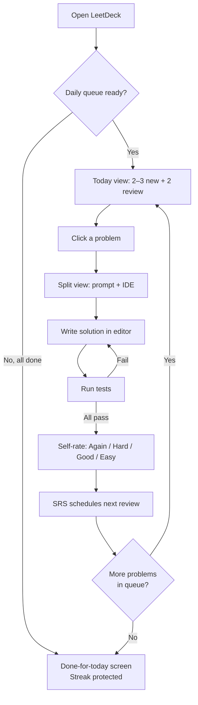
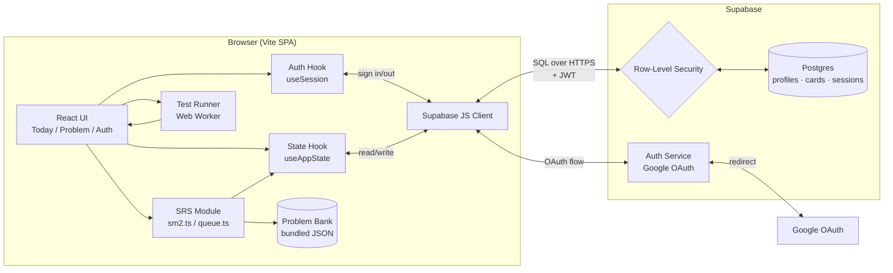
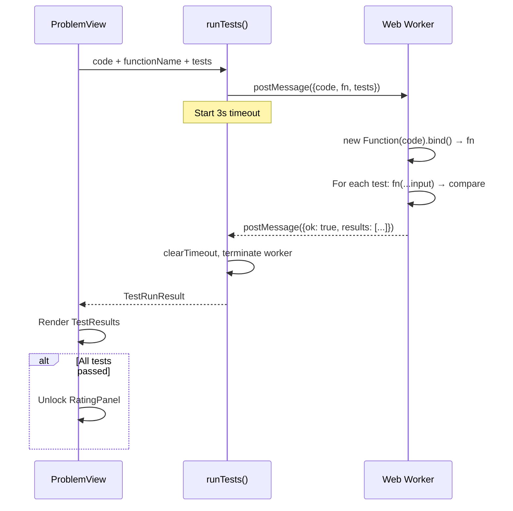
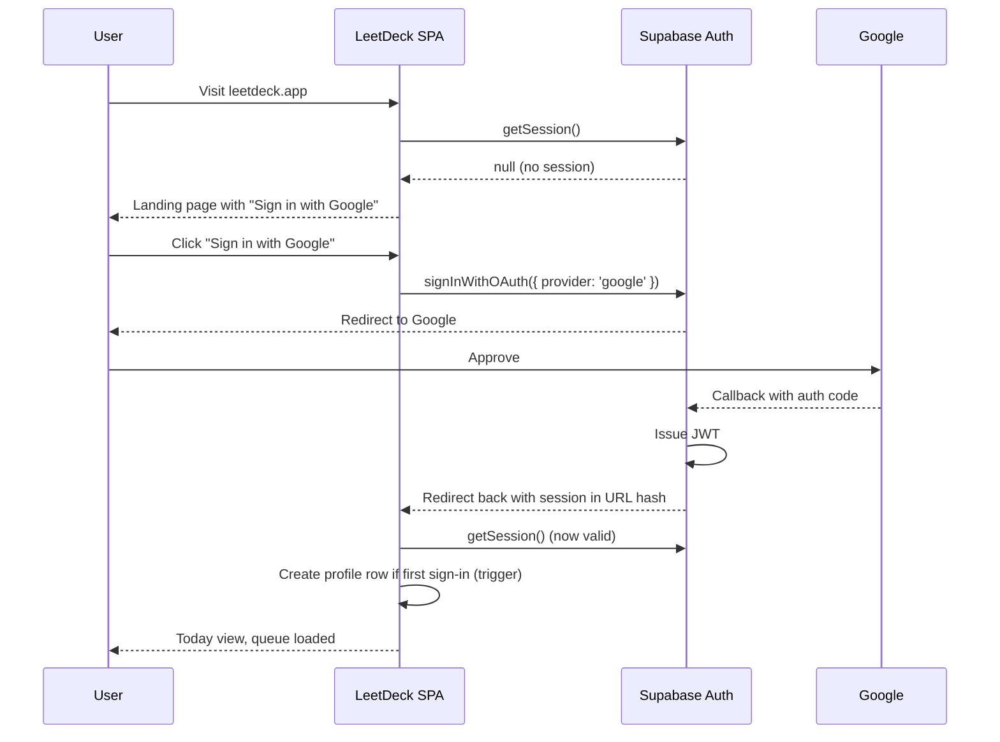
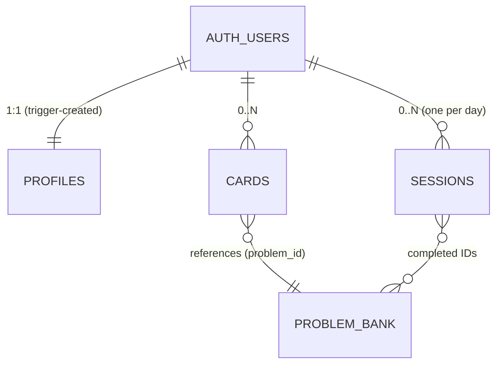

# LeetDeck — Design Doc

> Anki × NeetCode. A daily-driven LeetCode trainer that uses spaced repetition to make algorithm patterns stick.

**Hosted at:** `leetdeck.app` (planned). Closed source, single canonical instance.

---

## 1. Why this exists

People grind LeetCode in bursts before interviews, then forget everything two weeks later. Conversely, Anki users have proven that **short daily reps + spaced repetition** beats marathon sessions for long-term recall. LeetDeck merges the two:

- **NeetCode-style problem set** — curated, pattern-based, not a 3,000-problem dump.
- **Anki-style review schedule** — each problem you solve becomes a card that comes back at expanding intervals.
- **In-browser IDE** — solve in place, run tests, get instant feedback.
- **Accounts that follow you** — sign in with Google, your progress syncs across devices.

**The one-liner:** *Show me 2–3 new problems and 2 reviews every day. Make me actually retain the patterns.*

### 1.1 Product model

LeetDeck is a **hosted web app**. Users visit `leetdeck.app`, sign up with Google, and their progress lives in a database tied to their account. No self-hosting, no open repo — just a website.

The architecture is still deliberately simple: a Vite SPA backed by Supabase (managed Postgres + auth). No custom backend code to maintain.

---

## 2. The core loop (user-facing)



### A typical day

| Step | Time | What the user sees |
|---|---|---|
| 1 | 0s | Land on **Today** view. Streak counter, queue status, today's date. |
| 2 | 5s | List of cards: e.g., *New: Two Sum, Valid Anagram, Climbing Stairs* and *Review: Binary Search, Valid Parentheses*. |
| 3 | 10s | Click a card → split-pane: problem prompt on the left, code editor on the right. |
| 4 | 2–20 min | Solve. Hit **Run tests** as often as you want. |
| 5 | 30s | When all tests pass: rate your confidence. *Again* sends it back tomorrow; *Easy* pushes it out weeks. |
| 6 | repeat | Back to Today view. Next card. |
| 7 | done | When the queue is empty: streak ticks up, see "Come back tomorrow." |

---

## 3. System design

LeetDeck is a **Vite SPA** backed by **Supabase** (Postgres + auth). The browser talks directly to Supabase using their JS client — there is no custom backend to maintain. Auth is enforced at the database level via Postgres Row-Level Security (RLS), so users can only ever read/write their own rows even if they bypass the UI.

### 3.1 High-level architecture



**Why no custom backend?** Supabase exposes Postgres directly over HTTPS with auth-aware queries. RLS policies do the authorization work that a backend would normally do. This eliminates an entire tier and a whole class of bugs (e.g., "I forgot to check ownership on this endpoint").

### 3.2 Module responsibilities

| Module | Responsibility | Pure? |
|---|---|---|
| `lib/supabase.ts` | Singleton Supabase client, initialized from env vars. | ✗ |
| `auth/useSession.ts` | React hook exposing current user + sign-in/sign-out helpers. | ✗ |
| `auth/AuthGate.tsx` | Wraps app; shows landing/sign-in if no session, else children. | ✗ |
| `data/problems.ts` | Bundled problem bank. Static array of `Problem` objects. | ✓ |
| `srs/sm2.ts` | SM-2 algorithm. Pure functions: `applyRating(card, rating) → card`. | ✓ |
| `srs/queue.ts` | Builds today's queue from cards + problem bank. Pure. | ✓ |
| `srs/storage.ts` | **Supabase-backed:** fetches user's cards/profile/sessions, persists updates. Uses `useSession` for the JWT. | ✗ |
| `runner/runTests.ts` | Spins up a Web Worker, runs user code against tests with timeout. | ✗ |
| `components/CodeEditor.tsx` | Styled textarea with tab/indent handling. (Monaco later.) | ✗ |
| `components/ProblemPrompt.tsx` | Renders problem statement, examples, constraints. | ✓ |
| `components/TestResults.tsx` | Renders pass/fail breakdown. | ✓ |
| `components/RatingPanel.tsx` | The Again/Hard/Good/Easy buttons with interval preview. | ✓ |
| `views/LandingView.tsx` | Marketing-lite page with "Sign in with Google" CTA. | ✗ |
| `views/TodayView.tsx` | Daily dashboard: queue, streak, completed-today. | ✗ |
| `views/ProblemView.tsx` | Split solve view, orchestrates editor + runner + rating. | ✗ |
| `App.tsx` | Top-level router. Routes through `AuthGate`. | ✗ |

### 3.3 Why a Web Worker for code execution?

The user's JS is **untrusted by us, but trusted by them** (it's their own code). Two reasons we still use a Worker:

1. **Crash isolation.** An infinite loop in the user's code won't freeze the UI thread. We can `worker.terminate()` after a 3s timeout.
2. **Clean global scope.** The worker has no DOM, no React, no app state to accidentally mutate.

We do **not** sandbox for security against malicious code (it's the user's own code in their own browser). If we ever execute *other people's* code, we'd need a real sandbox (iframe + CSP, or remote VM).

### 3.4 Test-run sequence



If the timeout fires first, the worker is terminated and `runTests` resolves with `{ ok: false, error: "Execution timed out..." }`.

### 3.5 Auth flow (Google OAuth via Supabase)



**Key behaviors:**
- The Supabase JS client stores the session in `localStorage` and auto-refreshes it.
- All subsequent reads/writes attach the JWT; RLS uses `auth.uid()` to scope rows.
- On first sign-in, a database trigger creates a matching `profiles` row with defaults.
- Sign-out clears the local session; the next page load shows the landing page.

---

## 4. Data model

Three Postgres tables, all keyed on `auth.users.id` (the Supabase-managed user table). Every table has RLS enabled with the same policy: **`user_id = auth.uid()`**.

### 4.1 Schema

```sql
-- One row per user, created on first sign-in via trigger.
create table profiles (
  user_id          uuid primary key references auth.users(id) on delete cascade,
  display_name     text,
  avatar_url       text,
  new_per_day      smallint not null default 3,
  review_per_day   smallint not null default 2,
  streak           int not null default 0,
  last_active_date date,
  created_at       timestamptz not null default now()
);

-- One row per (user, problem) — only created the first time the user touches a problem.
create table cards (
  user_id         uuid not null references auth.users(id) on delete cascade,
  problem_id      text not null,                    -- e.g. 'two-sum'
  repetitions     int not null default 0,
  ease_factor     numeric(4,2) not null default 2.50,
  interval_days   int not null default 0,
  due_date        date not null default current_date,
  last_reviewed   date,
  total_reviews   int not null default 0,
  lapses          int not null default 0,
  updated_at      timestamptz not null default now(),
  primary key (user_id, problem_id)
);

-- One row per (user, date) — tracks what was completed each day.
create table sessions (
  user_id          uuid not null references auth.users(id) on delete cascade,
  session_date     date not null,
  new_completed    text[] not null default '{}',    -- array of problem_ids
  review_completed text[] not null default '{}',
  primary key (user_id, session_date)
);
```

### 4.2 Row-Level Security

Identical pattern on all three tables — no SQL trick, just enforcement:

```sql
alter table profiles enable row level security;
create policy "own profile" on profiles
  for all using (user_id = auth.uid()) with check (user_id = auth.uid());

alter table cards enable row level security;
create policy "own cards" on cards
  for all using (user_id = auth.uid()) with check (user_id = auth.uid());

alter table sessions enable row level security;
create policy "own sessions" on sessions
  for all using (user_id = auth.uid()) with check (user_id = auth.uid());
```

A user with a JWT can only see and modify rows where `user_id` matches their auth ID. The browser can hit the database directly because Postgres itself is doing the authorization.

### 4.3 First-sign-in trigger

```sql
create or replace function handle_new_user() returns trigger as $$
begin
  insert into profiles (user_id, display_name, avatar_url)
  values (
    new.id,
    new.raw_user_meta_data->>'name',
    new.raw_user_meta_data->>'avatar_url'
  );
  return new;
end; $$ language plpgsql security definer;

create trigger on_auth_user_created
  after insert on auth.users
  for each row execute procedure handle_new_user();
```

This means the app never has to write to `profiles` on sign-up — it just reads. One less round-trip and one less failure mode.

### 4.4 Diagram



`PROBLEM_BANK` lives in the bundled JS, not the DB. Problems are versioned with the app; they don't need a row each.

### 4.5 Storage cost

A heavy user has ~150 `cards` rows × ~80 bytes = 12KB, plus a year of `sessions` × ~100 bytes = 36KB. **~50KB per active user.** Supabase free tier (500MB) holds ~10K users without paying.

---

## 5. SRS algorithm

A pragmatic SM-2 variant with Anki's 4-button rating.

### State transitions on rating

| Rating | New repetitions | New interval | Ease delta |
|---|---|---|---|
| **Again** | reset to 0 | 1 day | −0.20 |
| **Hard** | +1 | first review: 3d; later: `prev × 1.2` | −0.15 |
| **Good** | +1 | first review: 6d; later: `prev × ease` | 0 |
| **Easy** | +1 | first review: 7d; later: `prev × ease × 1.3` | +0.15 |

`easeFactor` is clamped to a minimum of **1.3** (matches Anki's floor). Starting ease for a new card is **2.5**.

### Queue construction (each day)

```
new_today    = first N unseen problems (by Problem.order)
              where N = newPerDay − (already-done new today)

review_today = cards where dueDate ≤ today AND totalReviews > 0
              sorted by dueDate ASC
              limited to reviewPerDay − (already-done reviews today)
```

If the user closes the tab mid-session and reopens, the queue **resumes where they left off** — `history[today]` tracks what's already completed.

---

## 6. Tech stack

| Layer | Choice | Reason |
|---|---|---|
| Build tool | **Vite** | Instant HMR, zero config for React + TS. |
| Framework | **React 19 + TypeScript** | Familiar, great component model for split-pane UI. |
| Styling | **Tailwind v4** | Fast iteration, no separate CSS files. |
| Icons | **lucide-react** | Clean, tree-shakeable. |
| **Auth + DB** | **Supabase** (Postgres + Auth) | One service, generous free tier, RLS does authorization, direct from browser — no custom backend. |
| **Sign-in** | **Google OAuth** (via Supabase) | One-click for ~everyone. Add GitHub OAuth later. |
| Code editor | **Styled textarea** (v1) → **Monaco** (v2) | Avoids 5MB dep in MVP; swap is isolated to one component. |
| Execution | **Web Worker** (inline Blob) | No worker file build step. |
| Hosting | **Vercel** (recommended) | Auto-detects Vite, free for personal projects, custom domain support. |
| DNS | **Cloudflare or registrar of choice** | Point `leetdeck.app` at Vercel. |

**Deliberately not in v1:** Monaco, multiple sign-in methods, multiple languages (JS only), Gemini integration, paid tiers, leaderboards. All are notes in §11.

---

## 7. File structure

```
leetdeck/
├── DESIGN.md                  ← this file
├── README.md                  ← internal dev quick-start
├── .env.example               ← Supabase URL + anon key vars
├── package.json
├── vite.config.ts
├── tsconfig.json
├── index.html
├── supabase/
│   └── migrations/
│       ├── 001_schema.sql     ← tables: profiles, cards, sessions
│       ├── 002_rls.sql        ← row-level security policies
│       └── 003_triggers.sql   ← first-sign-in profile creation
└── src/
    ├── main.tsx               ← React root
    ├── App.tsx                ← top-level router, wraps in AuthGate
    ├── index.css              ← Tailwind imports + theme
    ├── types.ts               ← shared type defs
    ├── lib/
    │   └── supabase.ts        ← Supabase client singleton (reads env vars)
    ├── auth/
    │   ├── useSession.ts      ← session hook + sign-in/sign-out helpers
    │   ├── AuthGate.tsx       ← shows landing if no session
    │   └── callback.tsx       ← /auth/callback route handler
    ├── data/
    │   ├── problems.ts        ← problem bank entry (imports & exports all)
    │   └── problems/          ← one file per problem
    │       ├── two-sum.ts
    │       └── ...
    ├── srs/
    │   ├── sm2.ts             ← pure SRS algorithm
    │   ├── queue.ts           ← daily queue builder
    │   └── storage.ts         ← Supabase-backed reads/writes
    ├── runner/
    │   └── runTests.ts        ← Web Worker test runner
    ├── components/
    │   ├── CodeEditor.tsx
    │   ├── ProblemPrompt.tsx
    │   ├── TestResults.tsx
    │   ├── RatingPanel.tsx
    │   └── UserMenu.tsx       ← avatar + sign-out in header
    └── views/
        ├── LandingView.tsx    ← landing + "Sign in with Google" CTA
        ├── TodayView.tsx      ← daily dashboard
        └── ProblemView.tsx    ← split solve view
```

---

## 8. Adding problems

One file per problem under `src/data/problems/`. `src/data/problems.ts` imports and exports the array:

```ts
// src/data/problems.ts
import { twoSum } from './problems/two-sum';
import { validAnagram } from './problems/valid-anagram';
// ...
export const PROBLEMS: Problem[] = [twoSum, validAnagram, /* ... */];
```

Each problem file conforms to the `Problem` type from `src/types.ts`. Adding one is just a new file + a line in the index — no other code changes.

---

## 9. Deployment

LeetDeck has two pieces: the **Vite SPA** (deployed to Vercel) and the **Supabase project** (managed).

### 9.1 Required environment variables

```bash
# .env / Vercel env vars
VITE_SUPABASE_URL=https://your-project.supabase.co
VITE_SUPABASE_ANON_KEY=eyJhbGc...   # public anon key, safe in client
```

The anon key is *meant* to be public — RLS is what protects user data, not key secrecy.

### 9.2 One-time setup (you, the operator)

1. **Buy the domain.** `leetdeck.app` (or whatever) from any registrar.
2. **Create Supabase project.** supabase.com → new project (free tier). Wait ~2 min.
3. **Run migrations.** Open Supabase SQL Editor → paste `supabase/migrations/*.sql` in order.
4. **Enable Google OAuth.**
   - Google Cloud Console: create OAuth credentials (Web app).
   - Authorized redirect URI: `https://<project>.supabase.co/auth/v1/callback`.
   - Supabase: Auth → Providers → Google → paste Client ID + Secret.
5. **Configure auth URLs in Supabase.** Auth → URL Configuration → add `https://leetdeck.app` and `https://leetdeck.app/auth/callback`. **Without this, Google sign-in rejects the redirect in production.**
6. **Deploy to Vercel.**
   - `npx vercel` from project root, or connect GitHub repo.
   - Add `VITE_SUPABASE_URL` and `VITE_SUPABASE_ANON_KEY` env vars in Vercel dashboard.
7. **Point DNS.** In Vercel: Settings → Domains → add `leetdeck.app`. Follow the DNS instructions at your registrar. HTTPS is automatic.

That's the whole deploy. Subsequent deploys are `git push` (Vercel auto-builds on push to `main`).

### 9.3 Optional environment variables

| Var | Effect when set | Effect when unset |
|---|---|---|
| `VITE_GEMINI_API_KEY` | Enables AI hint button on problems | Hint button hidden — no error |

---

## 10. Build phases

### Phase 0 — Scaffold (½ day)
- Vite + React + TS + Tailwind setup
- `App.tsx` with a stub view
- Types file

### Phase 1 — Problem bank + static rendering (½ day)
- Author 10–12 problems with prompts, examples, tests
- `ProblemPrompt` renders prompt and examples
- Hard-coded route to one problem to verify rendering

### Phase 2 — IDE + test runner (1 day)
- `CodeEditor` (textarea with tab/indent handling)
- Web Worker test runner with timeout
- `TestResults` component
- Verify: write a wrong solution → see fails; right one → all pass

### Phase 3 — Supabase setup + auth (1 day)
- Create Supabase project, write migrations (schema, RLS, trigger)
- Enable Google OAuth provider in Supabase dashboard
- `lib/supabase.ts` client singleton
- `useSession` hook + `AuthGate` wrapper
- `LandingView` with "Sign in with Google" button
- `/auth/callback` route
- Verify: sign in works, profile row gets created automatically

### Phase 4 — SRS engine + DB-backed storage (1½ days)
- Pure SM-2 module (no I/O)
- `srs/storage.ts` reads/writes `cards` and `sessions` via Supabase
- Daily queue builder
- `RatingPanel` with interval previews
- Optimistic UI updates (don't wait for round-trip)

### Phase 5 — Daily loop (1 day)
- `TodayView` with queue, streak, completed-today
- Wire ProblemView → record completion + apply rating → upsert to Supabase
- "All done for today" screen
- `UserMenu` with avatar + sign-out

### Phase 6 — Polish + deploy (1 day)
- Draft auto-save (closing tab mid-solve doesn't lose code)
- Reset-to-starter button
- Loading / empty / error states for every async boundary
- Deploy to Vercel, point at domain, verify Google OAuth in prod
- Lint / typecheck clean

**Total MVP: ~6 days of focused work** (~2 days more than the localStorage version, almost entirely on auth + DB plumbing).

---

## 11. Out of scope for v1 (intentional)

These are tracked here so they don't bloat the MVP but aren't forgotten:

- **Monaco editor.** Swap-in for the textarea once everything else is solid.
- **Multiple languages.** v1 is JS-only because the in-browser test runner uses `new Function`. Python would need Pyodide.
- **Additional sign-in methods.** Google OAuth only in v1. GitHub OAuth and magic links are one-liners to add later.
- **Gemini integration.** Hints, solution explanations, generated practice problems.
- **Topic filtering / custom decks.** Today the order is fixed. Future: pick topics or build a custom queue.
- **Stats page.** Cards reviewed over time, ease distribution, lapses, hardest problems.
- **Leaderboards / social.** Possible because we have accounts now, but scope creep for v1.
- **Mobile UI.** Split-pane assumes desktop. Mobile would stack vertically or be its own design.
- **Import/export.** Download your data as JSON.
- **Dark mode.**
- **Paid tier.** Free for everyone in v1. Stripe + a `subscriptions` table is straightforward to add later.
- **Offline mode.** Requires a sync layer. Maybe v3.

---

## 12. Risks & open questions

| Risk | Mitigation |
|---|---|
| Infinite loops in user code freeze the worker | Handled: 3s timeout + `worker.terminate()`. |
| `JSON.stringify` for deep equality fails on `undefined`/`NaN` | Hand-rolled `deepEqual` in the worker (not stringify-based). |
| Problem bank is tiny (12 problems) | Adding a problem is one file in `src/data/problems/`. Target: 50 by v1.0, 150 by v2. |
| Self-rating is gameable (user just clicks "Easy") | That's fine — Anki has the same property. Tool for the honest, not a test. |
| SM-2 intervals feel wrong for code (vs. vocab) | Tune via the `Hard`/`Easy` multipliers. Add per-user ease adjustments later. |
| **A user can read another user's data** | Postgres RLS enforces `user_id = auth.uid()` on every table. Even a compromised browser can't bypass it. |
| **Supabase free tier ceiling** (50K MAU / 500MB DB) | More than enough for v1. If we hit it, $25/mo Pro tier covers another 100K MAU. |
| **Google OAuth misconfigured → users can't sign in** | Step-by-step setup in README. Smoke-test the production callback before each release. |
| **User wants to delete their account (GDPR)** | `on delete cascade` from `auth.users` clears their rows. Add a "Delete account" button in v1.1. |
| **Spam / abuse signups** | Google OAuth gates this (real Google account required). Add Supabase rate-limiting if needed. |
| **Supabase outage = app is down** | Accepted tradeoff for not running infra. Status page link in footer. |

---

## 13. Success criteria for v1

A new user visiting `leetdeck.app` should be able to:

1. Land on the marketing page, click **Sign in with Google**, and be in the app in under 10 seconds.
2. See **3 new problems + any due reviews** on Today view.
3. Solve a problem in the in-browser IDE, run tests, see pass/fail per case.
4. Rate their recall → see the next review date update.
5. Sign in **from a different device** and see the same progress (sync works).
6. Close the tab, reopen tomorrow → see new queue with overdue reviews carried over.
7. Maintain a visible **streak counter** across days.
8. Sign out cleanly.

If all eight work end-to-end without bugs, v1 ships.
